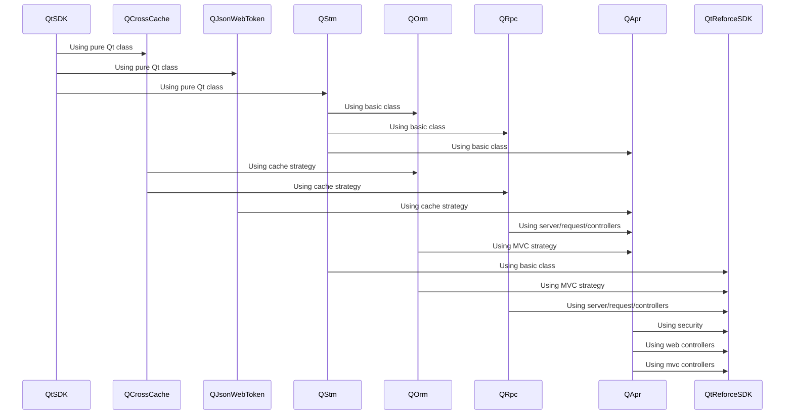
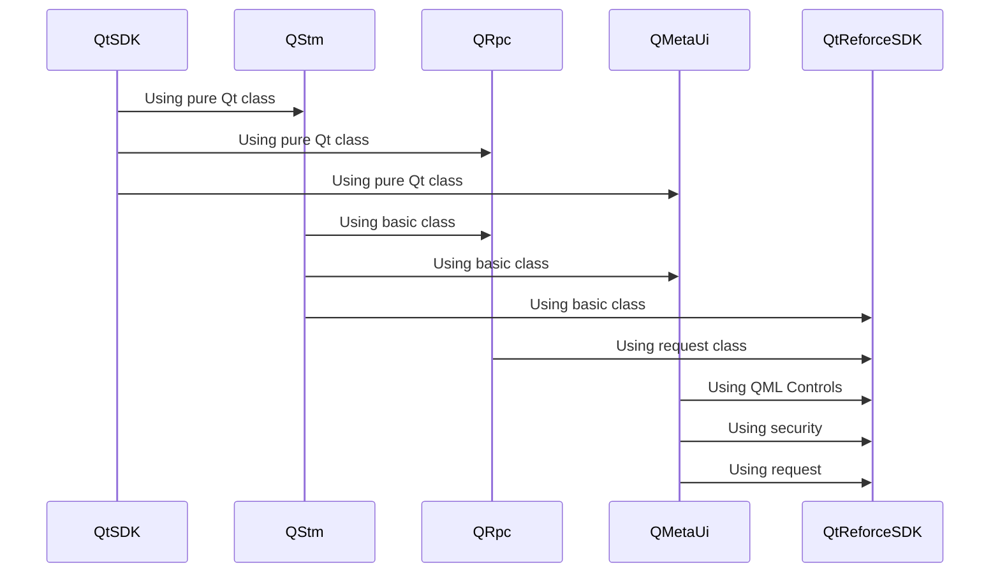

# QtReforceSDK

**SDK made in Qt/C++ to support backend and mobile app development.**


## Working architecture

>## Back-end and Services support

>## Mobile support


## Prerequisits
>```bash
> mkdir -p myproject/3rdparty;
> cd myproject/3rdparty;
> 
> git clone git@github.com:flaviomarcio/qtreforce-sdk.git
> //or
> git submodule add git@github.com:flaviomarcio/qtreforce-sdk.git
> 
> cd myproject/3rdparty/qtreforce-sdk;
> ./initrepository
>```


## CMake Build information

>```
>## initial CMake parameters 
>
>-GNinja
>-DCMAKE_BUILD_TYPE:STRING=Debug
>-DCMAKE_PROJECT_INCLUDE_BEFORE:PATH=%{IDE:ResourcePath}/package-manager/auto-setup.cmake
>-DQT_QMAKE_EXECUTABLE:STRING=%{Qt:qmakeExecutable}
>-DCMAKE_PREFIX_PATH:STRING=%{Qt:QT_INSTALL_PREFIX}
>-DCMAKE_C_COMPILER:STRING=%{Compiler:Executable:C}
>-DCMAKE_CXX_COMPILER:STRING=%{Compiler:Executable:Cxx}
>-DCMAKE_INSTALL_PREFIX=~/build/myproject/install/Debug
>```

>```bash
> cd qtreforce-sdk
> mkdir build;
> cd build;
> cmake ..;
> make;
> make install;
>```

## QMake Build information

>```bash
> cd qapr
> qmake qtreforce-sdk.pro
> make;
> make install;
> ls -l;
>```

## Configure QMake project

>```c++
>CONFIG += c++17
>CONFIG += console
>CONFIG += silent
>QT += gui core
>
>TEMPLATE = app
>TARGET = demo
>
>include($$PWD/3rdparty/qtreforce-sdk/qtreforce-sdk.pri)
>
>HEADERS += \
>    $$PWD/controllerMethods.h \
>    $$PWD/personModel.h \
>    $$PWD/personController.h
>
>SOURCES += \
>     $$PWD/controllerMethods.cpp \
>    $$PWD/personController.cpp \
>    $$PWD/main.cpp
>
>RESOURCES += \
>    $$PWD/settings.qrc
>```

## Resource settings for QtReforce QRpc/QOrm
>Settings for webservers and connection database server saved in setting.json and included in settings.qrc
>```json
>{
>   "arguments":["ws"],
>   "protocol":{
>      "default":{
>         "minThreads":1,
>         "maxThreads":2000,
>         "cleanupInterval":1000,
>         "readTimeout":60000,
>         "maxRequestSize":104857600,
>         "maxMultiPartSize":1048576000,
>         "enabled":false,
>         "sslKeyFile":"",
>         "sslCertFile":""
>      },
>      "http":{
>        "enabled":true,"port":[8888]
>      }
>   },
>   "connection":{
>       "secret": "YzUxNDFhMDA5",
>       "enviroment" : "debug",
>       "paramaters" : {
>           "debug":{
>               "driver":"QPSQL",
>               "hostName":"localhost",
>               "userName":"localuser",
>               "password":"localuser",
>               "port":5432,
>               "dataBaseName":"postgres",
>               "schemaNames":"public"
>           }
>       }
>   }
>}
>```


## Using QtReforce

>## Implementation main.cpp
>Check example in QApr/example/application
>```c++
>//main implementation
>
>#include <QtReforce/QApr>
>
>QAPR_MAIN_DECLARE()
>```

## Guide

>## Basic utilities class, SettingManager, MetaObjectUtil, VariantUtil, FormattingUtil, DoubleUtil, DateUtil, 
>Check documentation and examples
>https://github.com/flaviomarcio/qstm
>
>## Using web-servers controls
>Check documentation and examples
>https://github.com/flaviomarcio/qrpc
>
>## Using MVC controls
>Check documentation and examples
>https://github.com/flaviomarcio/qorm
>
>## Using back-end and services using web-server's and MVC
>Check documentation and examples
>https://github.com/flaviomarcio/qapr
>
>## Using cache strategy's
>Check documentation and examples
>https://github.com/flaviomarcio/qcrosscache
>
>## Using QML/class to create mobile application
>Check documentation and examples
>https://github.com/flaviomarcio/qmetaui