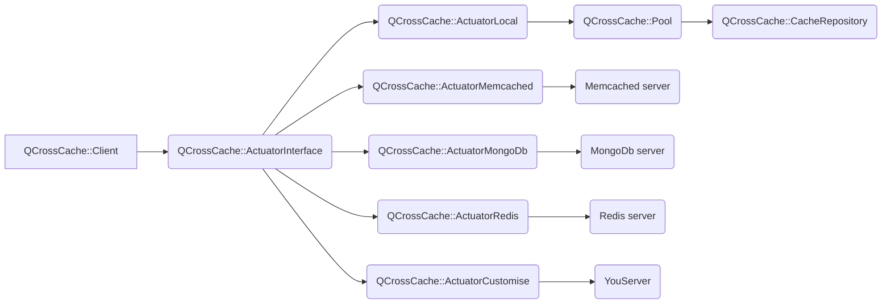

# QCrossCache

**Client to access cross-cache servers, used as a wrapper for memcached, mongodb, redis and direct access to localCache in raw memory.**


## Working architecture



## CMake Build information


>```
>## initial CMake parameters 
>
>-GNinja
>-DCMAKE_BUILD_TYPE:STRING=Debug
>-DCMAKE_PROJECT_INCLUDE_BEFORE:PATH=%{IDE:ResourcePath}/package-manager/auto-setup.cmake
>-DQT_QMAKE_EXECUTABLE:STRING=%{Qt:qmakeExecutable}
>-DCMAKE_PREFIX_PATH:STRING=%{Qt:QT_INSTALL_PREFIX}
>-DCMAKE_C_COMPILER:STRING=%{Compiler:Executable:C}
>-DCMAKE_CXX_COMPILER:STRING=%{Compiler:Executable:Cxx}
>-DCMAKE_INSTALL_PREFIX=~/build/qcrosscache/install/Debug
>```

>```bash
> cd qcrosscache
> mkdir build;
> cd build;
> cmake ..
> make -j4;
> make install;
>```

## QMake Build information

>```bash
> cd qcrosscache
> qmake qcrosscache.pro
> make;
> make install;
> ls -l;
>```

## Lib in you qmake application

>Check example in ../example/localcache

## Source in you application

>Check example in ../example/localcache


## Clients Connectors  

>```c++
> auto client=QCrossCache::clientForLocal(nullptr);
> auto client=QCrossCache::clientForMemcached(nullptr);
> auto client=QCrossCache::clientForMongoDb(nullptr);
> auto client=QCrossCache::clientForRedis(nullptr);
> 
>//main implementation
>#include <QCoreApplication>
>#include <QCrossCache>
>#include <QObject>
>#include <QDebug>
>
>int main(int argc, char *argv[])
>{
>    QCoreApplication a(argc, argv);
>
>    auto client=QCrossCache::clientForLocal(nullptr);
>    
>    //connection on server
>    if(!client->connect())
>        qDebug()<<"connection fail";
>        
>    //clear remote cache
>    if(!client->clear())
>        qDebug()<<"clear fail";
>        
>    //put key and value
>    QByteArray keyName("key");
>    QByteArray keyValue("value");
>    if(!client->put(keyName, keyValue))
>        qDebug()<<"put fail";
>
>    //get remote key
>    if(client->get(keyName)!=keyValue)
>        qDebug()<<"get fail";
>
>    //list key*
>    auto list=client->list("key");
>    for(auto&key:list)
>        qDebug()<<"list.key=="<<key;
>
>    //list all keys*
>    auto listKeys=client->listKeys();
>    for(auto&key:listKeys)
>        qDebug()<<"listKeys.key=="<<key;
>
>    if(client->take(keyName)!=keyValue)
>        qDebug()<<"take fail";
>
>    client->disconnect();
>    delete client;
>    return 0;
>}
>```

## Example

>```bash
> cd qcrosscache/examples
> ls -l;
>```


## Customize you client

>Check example in ../example/custom-implementation
>
>```c++
>#ifndef YourCustomClientImpl_H
>#define YourCustomClientImpl_H
>
>#include <QCrossCache>
>
>//!
>//! \brief The YourCustomClientImpl class
>//!
>class YourCustomClientImpl : public QCrossCache::ActuatorInterface
>{
>    Q_OBJECT
>public:
>
>    //!
>    //! \brief YourCustomClientImpl
>    //! \param parent
>    //!
>    Q_INVOKABLE explicit YourCustomClientImpl(QObject *parent = nullptr) : ActuatorInterface(parent)
>    {
>    }
>
>    //!
>    //! \brief YourCustomClientImpl
>    //! \param server
>    //! \param dataGroup
>    //!
>    explicit YourCustomClientImpl(QCrossCache::Server *server, const QByteArray &dataGroup) : ActuatorInterface(server, dataGroup)
>    {
>    }
>
>    //!
>    //!
>    ~YourCustomClientImpl()
>    {
>    }
>
>    //!
>    //! \brief connect
>    //! \return
>    //!
>    virtual bool connect()
>    {
>        return false;
>    }
>
>    //!
>    //! \brief disconnect
>    //! \return
>    //!
>    virtual bool disconnect()
>    {
>        return false;
>    }
>
>    //!
>    //! \brief isConnected
>    //! \return
>    //!
>    virtual bool isConnected()
>    {
>        return false;
>    }
>
>    //!
>    //! \brief clear
>    //! \return
>    //!
>    virtual bool clear()
>    {
>        return false;
>    }
>
>    //!
>    //! \brief exists
>    //! \param key
>    //! \return
>    //!
>    virtual bool exists(const QByteArray&key)
>    {
>        Q_UNUSED(key)
>        return false;
>    }
>
>    //!
>    //! \brief put
>    //! \param key
>    //! \param data
>    //! \return
>    //!
>    virtual bool put(const QByteArray&key, const QByteArray &data, const quint64 expiration=0)
>    {
>        Q_UNUSED(key)
>        Q_UNUSED(data)
>        Q_UNUSED(expiration)
>        return false;
>    }
>
>    //!
>    //! \brief get
>    //! \param key
>    //! \param data
>    //! \return
>    //!
>    virtual QByteArray get(const QByteArray&key)
>    {
>        Q_UNUSED(key)
>        return {};
>    }
>
>    //!
>    //! \brief get
>    //! \param key
>    //! \param data
>    //! \return
>    //!
>    virtual QByteArray take(const QByteArray&key)
>    {
>        Q_UNUSED(key)
>        return {};
>    }
>
>    //!
>    //! \brief remove
>    //! \param key
>    //! \return
>    //!
>    virtual bool remove(const QByteArray&key)
>    {
>        Q_UNUSED(key)
>        return false;
>    }
>
>    //!
>    //! \brief list
>    //! \param key
>    //! \return
>    //!
>    virtual QVector<QByteArray> list(const QByteArray&key)
>    {
>        Q_UNUSED(key)
>        return {};
>    }
>
>    //!
>    //! \brief listKeys
>    //! \param key
>    //! \return
>    //!
>    virtual QVector<QByteArray> listKeys()
>    {
>        return {};
>    }
>};
>
>//register interface client
>Q_CROSSCACHE_REGISTER_INTERFACE(redis,YourCustomClientImpl)
>
>#endif
>```